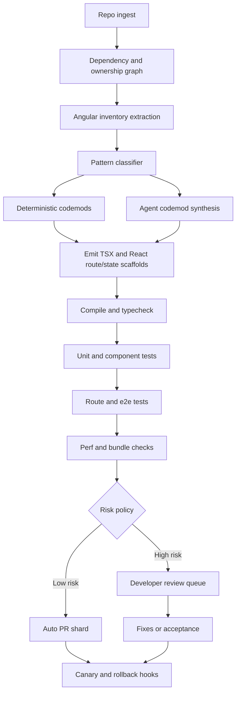
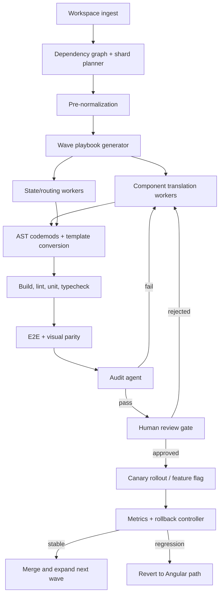

# Agentic Angular to React Migration at Scale

## Executive summary

Large-scale migration from Angular 2+ to React is now best approached as a **hybrid modernization program**, not as a single-shot code rewrite. The strongest evidence across both research and industry points in the same direction: deterministic structural analysis and codemods should do the bulk of the safe, repetitive work; agentic systems should plan, synthesize missing transformations, explain diffs, and repair validation failures; and humans should approve plans, review high-risk edits, and control rollout. Google’s monorepo migration work emphasizes “LLM + AST, better together” and reports that review and landing remain substantially human-driven. Amazon’s recent work on migration playbooks similarly argues that unconstrained long-horizon agents are too variable without structured guidance, and shows measurable consistency gains when planners are constrained by reusable migration knowledge. MigrationBench reaches a similar conclusion experimentally: a hybrid static-analysis-plus-agent approach can match the best fully agentic results while reducing LLM usage. 

For **Angular 2+ to React specifically**, public primary-source evidence is still thin compared with adjacent modernization domains such as Java version upgrades, library migrations, and breaking-dependency repair. Among the primary sources reviewed here, AWS Transform is the clearest public signal that vendors now treat Angular-to-React as a first-class agentic modernization target, listing an early-access Angular-to-React managed transformation and describing a broader platform that supports CLI execution, CI/CD, IDE handoff, MCP integration, and human-in-the-loop review. However, public evaluation numbers for that Angular-to-React transformation are not yet specified in the official documentation. citeturn28view0turn28view1turn29search2turn29search3

The practical conclusion is straightforward. If you are migrating a large Angular monorepo, the highest-probability path is to: normalize the Angular side first; build a repository graph and a migration inventory; encode deterministic mappings as codemods over TypeScript ASTs and Angular template ASTs; let agents generate or refine codemods where patterns are not yet covered; validate every shard with compile, unit, routing, and end-to-end tests; and expose explicit review gates for state management, routing, data fetching, accessibility, and performance. The best toolchains for this are the TypeScript compiler API or ts-morph for code intelligence, `@angular/compiler` or `@angular-eslint/template-parser` for templates, and Babel/Recast or jscodeshift or ast-grep-family tools for emission and bulk rewrites. For monorepos, Nx is the most directly relevant public build-graph control plane in the JavaScript ecosystem. 

## What the evidence base actually says

The academic literature that is closest to this problem is mostly **adjacent rather than direct**. I did not find a primary-source academic paper that evaluates large-scale Angular 2+ to React migration as its main task. Instead, the strongest papers study adjacent repository-level migration problems: Java LTS upgrades with agents and static analysis in MigrationBench, Python library migration with LLMs, agentic synthesis of reusable AST transformation rules for dependency updates, and synthesis of reusable migration scripts via PolyglotPiranha-compatible playbooks. That is important because it means the architectural lessons are strong, but Angular-specific quantitative claims are often still unspecified. 

MigrationBench is particularly relevant because it is explicitly **repository-level**, releases datasets and agent trajectories, and evaluates both purely agentic and hybrid workflows. It introduces a full dataset of 5,102 repositories, a selected subset of 300 repositories, and an evaluation framework that approximates functional equivalence through compile/test-based checks and dependency-upgrade verification. In the selected subset, a baseline Strands agent achieved 71.67% minimal migration efficacy, while prompt engineering and RAG improved maximal migration efficacy to 53.33%; the hybrid static-analysis-plus-agent approach matched that 53.33% maximal efficacy with fewer LLM calls, and the same hybrid approach scored 72.79% on a sampled subset of the larger full dataset. That is one of the clearest public results favoring **deterministic pre-processing plus agentic repair** over unconstrained autonomous editing.

The Google migration papers are the strongest industrial evidence for how this works in a real monorepo. Google describes a bespoke migration toolkit for repo-level changes, states that large migrations need custom solutions beyond IDE copilots, and explicitly says that a combination of AST-based techniques, heuristics, and LLMs is needed. In one experience report, Google’s Ads case study covers a 500M+ LOC codebase and adopts success as at least a 50% acceleration in end-to-end task completion, not merely “percent AI-written code.” In the detailed follow-up paper, Google reports 39 migrations over twelve months, 595 submitted code changes, nightly automation, and automated promotion of changes that pass validation for developer verification and routing to code owners. The same body of work stresses that planning should not be overused when simpler discovery–generation–validation loops suffice. citeturn12view1turn13view0turn13view1turn13view2turn13view3turn12view0turn38view0

AWS’s more recent modernization work adds a second important lesson: **reproducibility**. AWS argues that long-horizon migration agents are inherently variable, because small planning differences compound across hundreds of decisions. Their playbook work proposes a four-phase multi-agent pipeline that distills successful migration artifacts into structured books that both humans and AI planners can use. In their offline comparisons, adding a playbook improved consistency over a transformation-definition-only baseline by about 4.93% to 15.79% across three judges, with five of six comparisons statistically significant. That is directly relevant to Angular-to-React because UI migrations also involve long trajectories with many interdependent edits. citeturn32view0

The table below compares the most relevant primary-source papers and public industrial reports.

| Approach | Agents used | AST techniques | Human-in-loop | Scale | Pros | Cons | Links |
|---|---|---|---|---|---|---|---|
| Google monorepo migration toolkit and case study | LLM-backed migration system with discovery, generation, validation; exact internal agent count unspecified | Change-location discovery, categorization, validation; Google explicitly recommends AST-based techniques combined with LLMs | Yes; experts identify seed locations, review diffs, add missing tests, coordinate rollout | Google Ads codebase reported at 500M+ LOC; 39 migrations over 12 months; 595 code changes | Strongest real-world monorepo evidence; emphasizes end-to-end time saved and landing process | Not Angular-specific; many quantitative details are partially redacted or unspecified in public paper text | Google reports citeturn12view1turn12view0turn13view1 |
| MigrationBench hybrid repository migration | Strands agents; baseline, prompt-engineered, RAG, and hybrid variants | Static analysis + build/test evaluation + dependency verification | Indirect; benchmark workflow is automated, but designed for reproducible research rather than zero-human deployment | 5,102 repositories in full dataset; 300 in selected subset | Best public benchmark for repository-level migration; hybrid matched best maximal efficacy with fewer LLM calls | Java-focused, not UI-framework migration | MigrationBench citeturn10view3turn11view0turn11view1 |
| Using LLMs for Library Migration | Single-model migration runs, not a full multi-agent harness | Change-level migration evaluation; comparison against developer changes and tests | Limited; study evaluates model outputs rather than production workflow | 321 real-world migrations; 2,989 migration-related changes | Good evidence that LLMs can transform API usage at high change-level accuracy | Python libraries rather than frontend framework migration; end-to-end pass rates lower than change-level correctness | Paper citeturn10view5 |
| Spell playbook/script synthesis | Agentic synthesis that turns LLM knowledge into PolyglotPiranha scripts | Reusable scripted transformations, anti-unification, AST-compatible downstream scripts | Yes, because output scripts are inspectable, versionable, and reusable | 10 migration tasks; 870 validated examples; applied to 18 repositories | Closest academic support for “agents generate codemods, codemods do the work” | Evaluated on Python migration tasks, not Angular→React | Spell citeturn10view6turn4search0 |
| Agentic generation of AST transformation rules for breaking updates | Coding agents paired with AST engines; exact system depends on configuration | Explicit AST transformation engines; paper studies four LLMs and two AST engines | Yes, through generated reusable structured rules that can be inspected | Evaluated on real-world breaking dependency updates in Maven projects; exact repo count unspecified in snippet | Strong support for reusable AST rule generation instead of free-form patching | Public snippet does not provide all evaluation details; Java ecosystem | Paper summary citeturn3search7turn4search1 |
| AWS AI-generated migration playbooks | Four-phase multi-agent pipeline | Structured migration artifacts transformed into reusable playbooks that guide future transformations | Yes; playbooks are designed for human review and direct correction | Hundreds of repositories targeted by framing; direct experiment compares playbook versions from 10 vs 77 repos | Best public work on reducing agent variance at scale | Not Angular-specific; public experiment is on Python Lambda migration | AWS blog citeturn32view0 |

## Orchestration architectures that fit Angular to React

The most defensible architecture for Angular-to-React conversion is a **three-layer harness**:

1. a **deterministic analysis layer** that builds a repository graph and extracts Angular-specific inventories,
2. a **transformation layer** that applies codemods and emits React/TypeScript/JSX,
3. a **validation-and-governance layer** that compiles, tests, benchmarks, and routes suspect diffs to humans.

That structure aligns with Google’s discovery–generation–validation rhythm, MigrationBench’s hybrid workflow, and AWS’s playbook-guided reduction of planning variance. citeturn13view1turn11view1turn32view0



This architecture works best when the **planner is constrained**. Google explicitly warns that LLM planning can add unnecessary complexity, and AWS shows that playbooks narrow the planner’s solution space toward proven paths. In practice, that means the planner should not be asked “migrate this entire app.” It should instead operate over explicit shards such as “replace `routerLink` in feature X,” “convert `@Input/@Output` component family Y,” or “port NgRx slice Z.” citeturn13view0turn32view0

For the orchestration substrate itself, the public framework choices are mostly generic. LangGraph is explicitly positioned as a stateful, controllable orchestration framework for long-running agents with human-in-the-loop support; Microsoft AutoGen is an older but still official multi-agent framework now in maintenance mode; Semantic Kernel’s Process Framework is designed for structured, durable AI-integrated business processes with persistence and deployable runtimes. Those are reasonable control planes for a migration harness, but the migration-specific power still comes from the **tools the harness can call**: AST analyzers, codemods, builds, tests, and graph queries. citeturn18search0turn18search4turn18search1turn18search18turn18search2turn18search10

For large monorepos, **repository segmentation** is non-negotiable. Nx’s project graph, affected-project calculation, remote caching, distributed execution, task sandboxing, and AI-assisted self-healing CI provide exactly the kind of control surface needed to migrate incrementally without rebuilding the world on every change. Nx documents that it builds project graphs showing how everything connects, uses those graphs to decide task order and cacheability, and can run only tasks affected by a PR. citeturn8search15turn8search0turn8search1turn8search16


## Transformation mechanics and mapping patterns

Angular and React differ most at the **view layer contract**. Angular components combine a class, a template, and a selector; React components are primarily function components that return JSX. Angular inputs and outputs express dataflow at the template boundary; React uses props and callback props. Angular’s lifecycle hooks such as `OnInit` and `OnChanges` have to be re-expressed in React through render-time derivation, effects, or state transitions, and React’s own guidance is to avoid unnecessary effects when logic can be derived during render. That immediately suggests that a migration harness should not mechanically map every Angular hook to `useEffect`; it should first classify the hook body. citeturn25search7turn24search3turn24search9turn24search18turn24search15turn24search1turn24search2turn24search5turn24search17

A robust mapping matrix looks like this:

| Angular construct | React target | Notes |
|---|---|---|
| `@Input()` / signal input | props | Direct mapping when pure; default values become prop defaults or destructuring defaults. citeturn24search3turn24search1 |
| `@Output()` / `EventEmitter` / `output()` | callback props | Angular custom events do not bubble; React callback props are explicit parent-owned handlers. citeturn24search9turn24search16 |
| `ngOnInit` | render-time initialization, `useMemo`, or `useEffect` if external sync is required | Prefer render-time derivation for pure logic; effect only for external systems. citeturn24search18turn24search2turn24search5 |
| `ngOnChanges` | derived props/state logic or `useEffect` keyed by specific props | Only use effects when synchronization is unavoidable. citeturn24search15turn24search17 |
| `*ngIf` / `@if` | conditional JSX | Map to `if`, `&&`, or ternary based on complexity. citeturn23search2turn25search24 |
| `*ngFor` / `@for` | `array.map(...)` | Preserve stable keys explicitly. citeturn23search5 |
| `<ng-content>` | `children` or named-slot props | For multiple projection regions, use explicit prop slots. citeturn25search22turn24search1turn24search22 |
| `<router-outlet>` | `<Outlet />` | Nested route conversion is usually structural, not textual. citeturn37search1turn37search6 |
| `routerLink` | `<Link to>` | Absolute/relative route semantics need review at nested boundaries. citeturn37search9turn23search13 |

State translation should be handled as an explicit migration stream rather than as an incidental side effect of component conversion. NgRx defines actions, reducers, selectors, and effects as separate concepts: reducers manage pure state transitions; selectors derive slices of state; effects model side effects over action streams. Redux Toolkit is the closest React-side analogue for NgRx Store because it preserves reducer-oriented modeling and is explicitly designed for incremental migration of legacy Redux codebases. For smaller or localized Angular service patterns, React’s reducer-plus-context combination is often enough and aligns better with the framework’s preferred mental model. citeturn9search4turn9search0turn9search8turn9search12turn9search1turn9search25turn9search18turn9search2turn9search6

A good rule is:

- **NgRx global store** → **Redux Toolkit slices/selectors/middleware** when there is cross-route shared state, complicated async flows, or existing action discipline. citeturn9search0turn9search8turn9search12turn9search1turn9search25
- **Angular services with mostly business logic + local coordination** → **custom hooks + Context/useReducer** when the scope is bounded and prop drilling would otherwise become noisy. Angular’s own testing guidance describes services as holders of business logic, which maps naturally to React hooks or provider modules. citeturn22search15turn24search4turn9search18
- **Angular Signals** → **local React state or memoized derivations** if used as component-local reactive state; exact target is architecture-dependent and often best normalized before migration. citeturn24search12turn24search5

### Concrete transformation snippets

The TypeScript side of the migration is usually easiest to automate with ts-morph or the compiler API, because both preserve project context and types. ts-morph’s value is ergonomic access to AST navigation and manipulation over full TypeScript programs. citeturn6search0turn7search0

```ts
import { Project, SyntaxKind } from "ts-morph";

const project = new Project({
  tsConfigFilePath: "tsconfig.json",
});

for (const sf of project.getSourceFiles("src/**/*.ts")) {
  for (const cls of sf.getClasses()) {
    const componentDecorator = cls.getDecorator("Component");
    if (!componentDecorator) continue;

    const arg = componentDecorator.getArguments()[0];
    if (!arg || !arg.asKind(SyntaxKind.ObjectLiteralExpression)) continue;

    const obj = arg.asKindOrThrow(SyntaxKind.ObjectLiteralExpression);
    const selector = obj.getProperty("selector")?.getText() ?? "unspecified";
    const template = obj.getProperty("template")?.getText();
    const templateUrl = obj.getProperty("templateUrl")?.getText();

    console.log({
      file: sf.getFilePath(),
      className: cls.getName(),
      selector,
      inlineTemplate: Boolean(template),
      externalTemplate: templateUrl ?? null,
    });
  }
}
```

For template conversion, the safest path is to parse Angular templates with Angular-aware tooling, then emit JSX with a JS/TS printer such as Babel generator or Recast. Angular’s compiler and template-parser ecosystem are the right starting points because Angular templates are not just HTML. They include structural directives, microsyntax, bindings, pipes, outlets, and projection constructs. Angular’s language service works over inline and external templates; `@angular-eslint/template-parser` explicitly leverages `@angular/compiler` for template-aware analysis. citeturn5search0turn21search0turn21search3turn21search7

```ts
import { parseTemplate } from "@angular/compiler";
import * as recast from "recast";
import { builders as b } from "ast-types";

function angularTemplateToJsx(template: string) {
  const ast = parseTemplate(template, "inline.html", {
    preserveWhitespaces: false,
  });

  // Extremely simplified sketch:
  // *ngIf="cond"   -> {cond && <.../>}
  // *ngFor="let x of xs" -> {xs.map((x) => <.../>)}
  // [prop]="expr"  -> prop={expr}
  // (click)="onClick()" -> onClick={() => onClick()}
  // {{expr}} -> {expr}

  // In a real migrator, walk ast.nodes recursively and build Babel/ESTree JSX nodes.
  const jsx = b.jsxElement(
    b.jsxOpeningElement(b.jsxIdentifier("div"), [], false),
    b.jsxClosingElement(b.jsxIdentifier("div")),
    [b.jsxText("TODO: emitted JSX from Angular template AST")]
  );

  return recast.print(
    recast.types.builders.file(
      recast.types.builders.program([
        b.variableDeclaration("const", [
          b.variableDeclarator(b.identifier("view"), jsx),
        ]),
      ])
    )
  ).code;
}
```

For React emission and local codemods, Babel parser/traverse/types/generator or Recast/jscodeshift are still the standard stack. Babel’s parser supports JSX and TypeScript, while Recast focuses on nondestructive reprinting and source-map-friendly transforms. jscodeshift remains common for codemod authoring, although its current official maintainer notes limited active development at Meta; for greenfield large migration programs, ast-grep and newer codemod runtimes are increasingly attractive. citeturn6search1turn6search4turn6search10turn6search7turn6search2turn6search3turn6search9turn19search2turn19search13

```ts
// Example jscodeshift-style transform sketch:
// Replace <LegacyButton primary /> with <Button variant="primary" />
export default function transformer(file, api) {
  const j = api.jscodeshift;
  const root = j(file.source);

  root.findJSXElements("LegacyButton").forEach((path) => {
    path.node.openingElement.name.name = "Button";
    if (path.node.closingElement) path.node.closingElement.name.name = "Button";

    path.node.openingElement.attributes = path.node.openingElement.attributes.map((attr) => {
      if (attr.type === "JSXAttribute" && attr.name.name === "primary") {
        return j.jsxAttribute(j.jsxIdentifier("variant"), j.stringLiteral("primary"));
      }
      return attr;
    });
  });

  return root.toSource();
}
```

## Toolchains, products, and migration patterns that matter in practice

The tool choice should match the migration layer. For **inventory and semantic slicing**, use TypeScript compiler API or ts-morph. For **Angular templates**, use `@angular/compiler`-based tooling. For **React-side codemods**, use Babel/Recast/jscodeshift or ast-grep-family tools. For **orchestration and replayability**, use a workflow engine or managed migration service. For **monorepo control**, use Nx. For **runtime coexistence**, use custom elements or microfrontends selectively. citeturn7search0turn6search0turn21search0turn6search1turn6search2turn19search2turn19search13turn8search15turn25search1turn25search2turn25search9

### Tool comparison

| Approach | Agents used | AST techniques | Human-in-loop | Scale | Pros | Cons | Links |
|---|---|---|---|---|---|---|---|
| AWS Transform custom and managed transformations | Agentic AI platform; supports first-party, partner, and BYO agent workflows; agent count unspecified | Managed transformations, static analysis, knowledge artifacts, CLI/MCP/IDE integration | Yes; HITL review of plans and results is built into the web experience | Official docs describe multiple repositories, campaign tracking, CI/CD integration, and enterprise scale; exact Angular→React metrics unspecified | Most direct public product support for Angular→React agentic migration | Angular→React transformation is early access; public evaluation specifics are not yet published | AWS Transform docs citeturn28view0turn28view1turn29search2turn29search3turn29search4 |
| Amazon Q Developer transform | Agentic transformation workflow within IDE/CLI | Generates transformation plan, local build/test verification, diff review | Yes; summary and file diff reviewed before acceptance | Project-level; Java/.NET focus in public docs | Strong review-and-validate loop | Publicly targeted at Java/.NET rather than Angular→React | Amazon Q docs citeturn16search1turn16search7turn29search5turn29search17 |
| ts-morph | No built-in agents | TypeScript AST wrapper over compiler API | Developer-controlled | Large TS codebases; exact scale unspecified | Excellent ergonomics for semantic inventory, refactors, and codegen | Not for Angular HTML templates by itself | ts-morph docs citeturn6search0turn7search0 |
| Babel + Recast + jscodeshift | No built-in agents | JSX/TS parse, transform, and nondestructive print | Developer-controlled | Common codemod stack for large JavaScript/TypeScript codebases | Mature and flexible | Angular templates require separate parsing; jscodeshift maintenance velocity is limited | Babel/Recast/jscodeshift citeturn6search1turn6search2turn6search3turn6search9 |
| ast-grep and Codemod workflow/JSSG | Optional AI-assisted workflow authoring | Structural search/rewrite at scale with YAML rules or JSSG runtime | Yes; workflows and fixtures are inspectable | Explicitly meant for large-scale rewriting and multi-repo orchestration | Fast, replayable, easier to productionize than ad hoc scripts | Weaker semantic typing than full TS program analysis unless extended | ast-grep and Codemod docs citeturn19search2turn19search6turn19search13turn19search17 |
| Grit | Optional external agents | Declarative code search and transformation via GritQL | Yes; patterns are readable and testable | Docs say millions of lines and 10M+ line repositories | Strong for repeatable large-scale API migrations | Less Angular-template-specific than Angular-aware tooling | Grit docs citeturn35search0turn19search3 |
| PolyglotPiranha | Optional agent-generated scripts via Spell | Structural find/replace with deep cleanup | Yes; scripts are inspectable, versionable | Used by Uber for large-scale changes | Great for reusable scripted transformations and cleanup passes | Official support is strongest in languages Uber uses; TS/Angular support is not first-class in upstream docs | Piranha repo and Spell citeturn20search1turn20search4turn10view6 |
| Nx | No built-in migration agents, but integrates with them | Project graph, dependency graph, affected-project execution | Yes; directly supports CI/CD workflows and policy controls | Monorepo-first; graphing and agents published as core features | Best JS/TS monorepo control plane for incremental migration waves | Not itself a framework migration tool | Nx docs citeturn8search15turn8search0turn8search1turn8search16 |
| Builder.io Mitosis | Optional AI around it; compiler itself is deterministic | Compile-time cross-target component translation from JSX-based source | Yes; generated outputs and plugins are explicit | Useful for shared design-system components; monorepo scale unspecified | Very useful for “write once, target Angular and React” bridge components | Not a turn-key Angular-app-to-React-app migrator | Mitosis docs citeturn36search0turn36search11turn36search17 |

### Case studies and real-world patterns

| Approach | Agents used | AST techniques | Human-in-loop | Scale | Pros | Cons | Links |
|---|---|---|---|---|---|---|---|
| Google bespoke migration toolkit | LLM-backed automation with nightly runs | Change localization, validation, AST + heuristics + LLMs | Strongly yes | 500M+ LOC environment; 39 migrations; 595 code changes | Best public evidence for monorepo safety model | Not Angular-specific | Google papers/blog citeturn12view1turn12view0turn17search0 |
| AWS Transform custom | Agentic managed service with CLI, web, MCP, IDE handoff | Static analysis, managed transformations, playbooks, campaign tracking | Strongly yes | Officially described as working across one or multiple repositories with campaign management | Closest public platform to “Angular→React with agentic harness” | Exact Angular→React outcomes unspecified | AWS docs/blogs citeturn28view1turn28view0turn32view0 |
| Amazon Q Developer transform | Agentic transform in IDE/CLI | Plan generation + build/test verification + diff review | Yes | Project-level, enterprise-oriented | Excellent review loop and local verification pattern | Public scope is Java/.NET, not Angular→React | Amazon Q docs citeturn16search1turn16search7turn29search5 |
| single-spa bridge pattern | No built-in agents | Runtime coexistence rather than AST transformation | Yes, because incremental routing cutovers are team-controlled | Microfrontends across frameworks; scale unspecified | Useful for incremental coexistence of Angular and React in the same page | Adds operational/runtime complexity if overused | single-spa docs citeturn25search2turn25search5turn25search14 |
| Angular custom elements into React host | No built-in agents | Framework bridge via custom elements | Yes | Component-level coexistence; scale unspecified | Good bridge for isolated leaf widgets; React 19 improves custom-element interoperability | Not ideal for deep shared state or router-heavy features | Angular and React docs citeturn25search1turn25search9 |

A practical nuance matters here. **Bridging is not the same thing as migration.** single-spa and custom elements are best used as **temporary runtime coexistence tools** that let you cut over route by route or widget by widget. They should not become a permanent mixed-framework end state unless you purposely want microfrontends. single-spa explicitly describes mixed-framework microfrontends as useful during migration or experimentation, while React 19’s improved custom-element support makes Angular Elements a more viable bridge inside a React host than it used to be. citeturn25search2turn25search14turn25search1turn25search9

## A concrete implementation blueprint for a large Angular monorepo

The implementation sequence that best fits the evidence is the following.

Begin by **stabilizing the Angular side**. Turn on strict template checking where possible, move legacy tests toward the current Angular testing stack, and consider running Angular’s own migrations to modernize patterns before you leave Angular. Angular documents incremental migrations for standalone components, control-flow syntax, `inject`, signal inputs, outputs, and build-system updates; these official migrations explicitly recommend running stepwise and manually checking the build between steps. That is valuable because an upgraded Angular codebase is easier for both codemods and agents to reason about. citeturn5search15turn21search2turn21search6turn21search18turn21search8turn21search16turn22search19turn22search11

Then create a **migration inventory**. Extract every Angular component, template, route, service, NgRx store/effects module, shared library, and third-party UI dependency. Build a project graph with Nx and a semantic inventory with ts-morph. For template-heavy features, classify components into “mechanical,” “moderate,” and “high-risk.” Mechanical components use basic bindings, class/style bindings, events, `*ngIf`, and `*ngFor`; moderate ones add projection, directives, and simple routing; high-risk components include dynamic forms, heavy RxJS orchestration, content projection with multiple slots, dynamic component loading, or template metaprogramming. This classification is a harness input, not a side note. citeturn8search0turn8search1turn6search0turn7search0turn25search22turn37search15

Next, encode **deterministic mappings first**. That usually means:

- TS codemods for imports, class-to-function skeletons, prop extraction, and test harness updates.
- Template-AST codemods for bindings, loops, conditions, outlets, router links, and content projection.
- State mapping codemods for NgRx reducer/action/selector scaffolding into Redux Toolkit or provider/hook modules.
- Route codemods to turn Angular route definitions into React Router route objects and nested outlet structures. citeturn23search0turn23search1turn37search1turn37search6turn9search0turn9search8turn9search12turn9search1

Only after those deterministic passes should agents be allowed to synthesize missing logic. The most effective pattern in the literature is not “ask the model to rewrite the app,” but “ask the model to produce a reusable codemod, transformation script, or playbook entry.” Spell and the AST-rule-generation work both support this model, and AWS’s playbooks show why it improves consistency. citeturn10view6turn3search7turn32view0

Validation must happen at **every shard**. The minimum gate set for each shard is: TypeScript compile/typecheck, Angular or React unit tests, route smoke tests, e2e tests for the touched flow, and a rollback mechanism. Angular and React Testing Library/Playwright documentation provide the individual primitives; Nx `affected` gives you the monorepo control plane to keep this affordable. For React-side app shells, Vite is a sensible target build system because of its fast development loop and straightforward production build model. citeturn22search11turn22search1turn22search2turn22search6turn8search1turn22search0turn22search20

Human review is mandatory at several points:

- **plan approval** for each migration wave,
- **component family signoff** for stateful and projected components,
- **route boundary review** when nested layouts or guards are translated,
- **store/effects review** for NgRx-to-Redux or Context decisions,
- **UI equivalence review** for forms, tables, virtualized lists, and accessibility-sensitive components,
- **rollout approval** for canary, traffic shifting, and Angular-bridge retirement.  

That review cadence is exactly what the strongest industrial reports recommend: Google leaves review and landing largely human-driven; AWS exposes review of plans and results in HITL flows; Amazon Q requires review of transformation summaries and diffs before acceptance. citeturn13view3turn13view1turn29search3turn29search17turn16search7

The success metrics that matter are not just “how much code the model wrote.” The best public industrial metric is Google’s end-to-end time saved for the actual migration task, including discovery, review, and rollout. MigrationBench adds compile/test-based approximation of functional equivalence and dependency-upgrade completeness. AWS adds reproducibility and consistency across runs. For Angular-to-React, I would therefore track at least the following metrics per wave: compile success rate, unit-test parity, e2e parity, route parity, percentage of diffs produced fully by deterministic codemods, variance across repeated dry runs, manual edit distance after agent/codemod output, PR review latency, rollback frequency, and bundle/performance deltas after cutover. When exact public thresholds are unavailable, that is because they are organization-specific rather than standardized in the literature. citeturn13view1turn10view3turn11view3turn32view0

## Bottom-line recommendations

For a large Angular monorepo, the most rigorous and realistic strategy is to treat the migration as a **replayable transformation system**. Use ASTs and graph analysis to decide what can be migrated safely. Use agents to generate codemods, playbooks, and repair patches, not to freestyle across the whole repository. Use Nx or an equivalent graph-aware build runner to control blast radius. Use React Router, Context, and Redux Toolkit deliberately, based on the shape of the existing Angular routing and NgRx/service topology. Use single-spa or custom elements only as temporary coexistence mechanisms. And judge success by validated, repeatable, low-variance delivery—not by how “autonomous” the system sounds. That conclusion is the one most strongly supported by the combination of primary research, official tooling docs, and public industrial case studies reviewed here. citeturn13view0turn11view1turn32view0turn8search15turn25search2turn25search9

A final caveat is worth making explicit. **Exact evaluation numbers for Angular 2+ → React at monorepo scale are still largely unspecified in public primary sources.** The direct public product signal is strong, especially from AWS Transform’s early-access Angular-to-React support, but the strongest published quantitative evidence still comes from adjacent migration domains. That does not weaken the architectural recommendation; it mostly means that teams should expect to generate their own internal baselines and acceptance thresholds for Angular-specific correctness, route equivalence, and UI semantics. citeturn28view0turn10view3turn12view1turn32view0


# Agentic Harness Designs for Migrating Large Angular Codebases to React

## Executive summary

The strongest primary-source evidence does **not** come from a large academic literature specifically about **Angular 2+ to React** conversion. Instead, it comes from three adjacent evidence streams that fit together unusually well: repository-scale migration research from Google and Amazon, concrete industry case studies for Angular→React or framework migration, and production-grade AST/codemod/orchestration toolchains. In the source set gathered here, the most directly relevant Angular→React case studies are ZoomInfo’s multi-agent Angular-to-React rewrite and AWS Transform’s Angular→React materials, while the academic papers focus on analogous large-scale migration problems such as Java 8→17, Python library migration, and reusable AST repair rules for breaking dependency updates. citeturn37view0turn35view0turn15view0turn12view2turn18search0turn18search5

The most credible design pattern that emerges is **not** “let an autonomous agent rewrite the monorepo.” It is a **hybrid harness** with deterministic discovery and validation around a narrower generative core: use dependency graphs and AST tooling to shard the migration, use specialized agents for planning and translation, require machine-verifiable builds/tests after each step, and insert explicit developer approval gates before cross-boundary changes, rollout, or production merges. That pattern is visible in Google’s LLM+AST workflow, AWS’s playbook-guided multi-agent pipeline, Amazon’s hybrid static-analysis-plus-agent MigrationBench system, and ZoomInfo’s Team Lead / worker / audit-agent design. citeturn13view0turn13view3turn17view0turn12view2turn37view0turn38view0

For **large monorepos**, the best-supported execution model is: normalize Angular first where possible, compute graph-based migration shards, migrate route-by-route or slice-by-slice behind flags, keep Angular and React coexisting during the overlap window, and let CI run only on affected projects with distributed execution and remote caching. Nx’s project graph, affected execution, remote caching, and distributed task execution line up almost exactly with what an Angular→React migration harness needs operationally. citeturn25search0turn25search1turn25search2turn24view0turn24view1turn23view6turn23view7

A practical conclusion follows. If the goal is a safe, high-throughput Angular→React migration, the harness should be built around **five invariants**: deterministic shard selection, repeatable codemods, strict validation loops, durable human checkpoints, and reversible rollout. The sources support all five. What they do **not** yet support is the idea that fully autonomous framework conversion is reliable enough, by itself, for enterprise monorepos. Google explicitly keeps review and rollout largely human-driven; AWS emphasizes reproducibility and human reviewable “playbooks”; ZoomInfo reports substantial gains but also recurring “AI slop,” memory leaks in generated tests, architectural hallucinations, and infinite AST-fix loops that required supervision. citeturn13view3turn17view0turn16view4turn37view0turn38view0

## What the primary sources actually show

Google’s large-scale migration work is the clearest academic-industry anchor for how to structure a serious migration harness. In a case study accepted at FSE 2025, Google reports **39 distinct migrations**, **595 submitted code changes**, and developer-estimated reductions in total migration time versus previous manual approaches. More importantly for harness design, the paper describes a workflow that combines **change location discovery**, **LLM edit generation**, **automatic validation**, and **human verification/acceptance**. Google explicitly argues for **LLM+AST together**, not LLM-only generation. Discovery and validation are handled “mostly using deterministic AST techniques,” while the LLM is concentrated on edit generation and repair of build/test failures. citeturn15view0turn13view0turn13view3

A second Google experience report gives even more tactical guidance. It says the company built a common migration toolkit whose project-specific customizations live in prompts and validation steps, while **review and rollout remain largely human-driven**. It also argues against adding planning complexity when simpler “localize-edit-validate-repair” loops suffice, echoing a broader “agentless beats elaborate planning” theme for some repository-scale tasks. For Angular→React, that implies the harness should use agents where they add leverage, but avoid gratuitous multi-agent complexity in the inner loop. citeturn13view1turn13view2turn13view3

Amazon’s MigrationBench paper is the strongest open research artifact on **repository-level migration evaluation**. It provides both a benchmark and an agentic framework for Java 8 migration, including baseline agent, prompt-engineered agent, RAG agent, and a **hybrid approach** that first performs deterministic dependency upgrades via static analysis and then uses the agent to resolve build breakages and remaining incompatibilities. On the selected subset, the hybrid approach matched the best agentic results while cutting LLM use by **11%**, and the paper reports a **53.33%** maximal migration success rate on the selected benchmark subset with Claude-4.5-Sonnet. The numbers are for Java, not Angular→React, but the architectural lesson generalizes directly: deterministic upgrades first, agentic repair second. citeturn12view2

AWS’s recent work adds a second lesson: **consistency matters as much as correctness** for long-horizon migrations across many repositories. AWS describes a **four-phase multi-agent pipeline** that turns migration artifacts into structured “playbooks,” then uses those playbooks to constrain future planning. In offline experiments, playbook-guided planning improved consistency by **4.93% to 15.79%**, with five of six judge comparisons statistically significant. That is directly relevant to Angular→React because framework rewrites are high-variance tasks: if planners, workers, or codemods are not strongly constrained, two runs can produce different file sets, different component decompositions, and different state-management decisions. citeturn17view0turn16view1turn16view2

ZoomInfo’s 2026 engineering report is the best directly relevant end-to-end Angular→React harness description in the gathered set. They rewrote a core feature from Angular to React using a **hierarchical agent team**: one Team Lead agent, **15** worker agents, shared memory files, modular migration documents, the TypeScript language server for compiler/LSP feedback, and Playwright MCP for browser-based testing. The reported scope was **938 files**, with a historical baseline of **six months by 4–5 engineers** versus **about one week** of agent-driven work on a single machine, followed by human attention on “last mile” architectural issues. The same report is also a warning: they observed architectural hallucinations when mapping Angular DI and RxJS into idiomatic React, asynchronous test leaks, and cyclical AST self-correction loops. citeturn37view0turn38view0

AWS Transform provides the most concrete vendor documentation for production deployment shape. AWS documents an **early-access Angular-to-React managed transformation**, a CLI that supports **interactive**, **direct interactive**, and **headless CI/CD** execution modes, support for **MCP servers**, workspace-level **worklogs**, **approvals**, and role-based control over critical HITL actions such as “merging to main” or “deploying code to production.” AWS also surfaces customer testimony that The Gnar Company saw a **75% timeline reduction** across several Angular-to-React projects, though the exact repository scale is **unspecified**. citeturn12view4turn22view0turn22view1turn22view2turn35view0

For incremental coexistence, the primary-source picture is unusually clear. Angular can expose components as **custom elements** through `@angular/elements`, and those elements bootstrap themselves when placed in the DOM. React 19 now has **full support for custom elements**, including improved property handling on both client and server. For larger route-level coexistence, single-spa explicitly supports microfrontends across frameworks such as Angular and React and exists to mount and unmount them in a framework-agnostic way. This makes “bridge first, replace later” a concrete and source-backed migration tactic rather than just architecture folklore. citeturn27view2turn27view1turn27view0

## A reference harness for Angular-to-React at monorepo scale

The best evidence-backed harness is a **graph-first, wave-based, HITL-supervised** system. It should begin with repository discovery and normalization, then shard the migration into independently verifiable waves, run codemods and agentic translation inside each shard, and require explicit approval before cross-boundary merges or rollout. This is a synthesized design, but every major element is grounded in the sources: Google for LLM+AST validation loops, AWS for playbook and HITL structure, ZoomInfo for hierarchical agent teams, LangGraph and Microsoft Agent Framework for durable orchestration and human interruption, and Nx for graph-aware execution at monorepo scale. citeturn13view0turn13view3turn17view0turn37view0turn12view5turn12view6turn24view0turn24view1



In practice, the **shard planner** should be deterministic. It should use the monorepo graph to define migration waves as route slices, feature libraries, or component islands with minimal fan-out. Google’s report describes using cross-reference graphs to answer “which files should migrate together,” where interfaces fan in/out, and whether calls escape the current component scope. Nx provides the concrete implementation substrate: project graphs, affected execution, task graphs, and APIs to compute the graph programmatically. citeturn13view1turn24view1turn24view2turn23view5

The most effective **pre-normalization** step is to make the Angular side easier to translate before translating it. Angular now offers official migrations for **standalone components**, **control-flow syntax**, and the **`inject()`** function. Moving old Angular code toward those normalized forms reduces the number of translation cases your harness has to support. For example, standalone components reduce NgModule complexity; control-flow syntax brings template logic closer to explicit structural blocks; `inject()` makes DI more local and analyzable. citeturn25search0turn25search1turn25search2turn25search8

For orchestration, a two-tier model has the best evidence. At the top level, use a durable workflow runtime such as **LangGraph** or **Microsoft Agent Framework** so the harness can pause, persist, resume, and track state through approvals, retries, and long-running waves. LangGraph explicitly emphasizes **durable execution** and **human-in-the-loop**. Microsoft Agent Framework emphasizes graph-based multi-agent workflows with **checkpointing**, **human-in-the-loop**, **time-travel**, and built-in observability. Those are unusually well matched to large framework migrations, which often need to be interrupted, rolled back, or resumed after human review. citeturn12view5turn11search1turn12view6

At the lower level, use **specialized agents** with narrow authority instead of one omnipotent migration model. A good split is planner, sharder, translator, audit agent, test agent, and release controller. ZoomInfo’s case study shows why this matters: their Team Lead coordinated worker agents, restarted stalled ones, accepted audit feedback, and escalated complex components to humans. AWS’s playbook work shows that the planner should consume accumulated migration knowledge rather than improvising from scratch. citeturn37view0turn38view0turn17view0

Human oversight should be designed as a **small number of hard stops**, not constant interruption. The highest-value gates are: approving or editing the wave plan/playbook, approving cross-boundary interface changes, approving PRs that cross ownership/team boundaries, and approving rollout to broader traffic. AWS Transform’s permissions model is a good reference: administrators can approve critical HITL actions such as merge-to-main or production deployment, while contributors can participate in non-critical HITL work. citeturn22view1turn22view2

## Concrete transformation methods and runnable building blocks

The core transformation stack should be **polyglot, layered, and explicit about what is deterministic versus what is inferential**. For TypeScript and Angular source files, `ts-morph` is the easiest high-level wrapper around the TypeScript Compiler API for static analysis and programmatic code changes. For JavaScript/TypeScript codemods, the canonical stack is **Babel parser + jscodeshift + Recast**. For fast structural rewrites, **ast-grep** and **JSSG** are especially attractive because they can express many repetitive template and syntax migrations as declarative rules, and JSSG adds guardrails with a deny-by-default capability model. citeturn23view0turn23view1turn23view2turn23view3turn23view4turn29view2turn29view0

For Angular templates, the most practical parser choices are either `@angular/compiler`-based parsing or `@angular-eslint/template-parser`, which explicitly **leverages `@angular/compiler`**. The caution is important: direct compiler AST usage is powerful, but stability details are not strongly guaranteed as public product contracts. A recent Angular issue showed `parseTemplate` AST node-name changes across patch versions, which is enough to justify pinning versions tightly and isolating the parser adapter behind your own abstraction layer. citeturn20search0turn20search17turn31view0

A reliable Angular→React codemod pipeline usually needs four deterministic passes before any agent writes free-form code:

1. **Discovery pass**: enumerate components, templates, routes, services, NgRx stores, and external dependencies.  
2. **Normalization pass**: standalone/inject/control-flow migrations plus formatting and lint cleanup.  
3. **Bridging pass**: establish coexistence scaffolding such as custom elements, single-spa parcels, or feature-flagged React routes.  
4. **Translation pass**: narrow codemods for inputs/outputs, template control flow, routing, service/hooks wrappers, and state selectors/actions. citeturn25search0turn25search1turn25search2turn27view2turn27view0

### Illustrative discovery snippet with `ts-morph`

The following snippet is a realistic starting point for a component inventory pass. It uses `ts-morph`, then records the data a planner needs for shard definition and later translation.

```ts
import { Project, SyntaxKind } from "ts-morph";

type ComponentInventory = {
  file: string;
  className: string;
  selector?: string;
  template?: string;
  templateUrl?: string;
  inputs: string[];
  outputs: string[];
  implementsOnInit: boolean;
  implementsOnChanges: boolean;
};

const project = new Project({
  tsConfigFilePath: "tsconfig.base.json",
});

const inventory: ComponentInventory[] = [];

for (const sf of project.getSourceFiles("apps/**/src/**/*.ts")) {
  for (const cls of sf.getClasses()) {
    const dec = cls.getDecorator("Component");
    if (!dec) continue;

    const arg = dec.getArguments()[0];
    const meta =
      arg && arg.getKind() === SyntaxKind.ObjectLiteralExpression
        ? arg.asKindOrThrow(SyntaxKind.ObjectLiteralExpression)
        : undefined;

    const propString = (name: string) =>
      meta?.getProperty(name)
        ?.asKind(SyntaxKind.PropertyAssignment)
        ?.getInitializer()
        ?.getText();

    const inputs = cls.getProperties()
      .filter((p) => !!p.getDecorator("Input"))
      .map((p) => p.getName());

    const outputs = cls.getProperties()
      .filter((p) => !!p.getDecorator("Output"))
      .map((p) => p.getName());

    inventory.push({
      file: sf.getFilePath(),
      className: cls.getName() ?? "AnonymousComponent",
      selector: propString("selector")?.replace(/^['"`]|['"`]$/g, ""),
      template: propString("template"),
      templateUrl: propString("templateUrl")?.replace(/^['"`]|['"`]$/g, ""),
      inputs,
      outputs,
      implementsOnInit: cls.getImplements().some((i) => i.getText().includes("OnInit")),
      implementsOnChanges: cls.getImplements().some((i) => i.getText().includes("OnChanges")),
    });
  }
}

console.log(JSON.stringify(inventory, null, 2));
```

This kind of inventory directly supports wave planning, ownership mapping, and graph-aware shard assignment. `ts-morph` is specifically intended to make TypeScript/JavaScript navigation and manipulation easier than using the raw compiler API directly. citeturn23view0

### Illustrative template conversion shape with `@angular/compiler`

For Angular templates, a pragmatic pattern is to parse the template into Angular AST, lower that tree into a migration IR, and only then print JSX. The IR is worth the effort because it lets you separate Angular-specific parsing from React-specific printing and makes audit checks easier.

```ts
import { parseTemplate } from "@angular/compiler";

type JSXNode =
  | { kind: "element"; tag: string; attrs: Record<string, string>; children: JSXNode[] }
  | { kind: "text"; value: string }
  | { kind: "expr"; code: string };

export function angularTemplateToIR(template: string): JSXNode[] {
  const parsed = parseTemplate(template, "inline.html", { preserveWhitespaces: false });

  // Pseudocode: walk Angular AST and normalize
  return parsed.nodes.map((node: any) => visit(node));

  function visit(node: any): JSXNode {
    switch (node.constructor?.name) {
      case "Element":
        return {
          kind: "element",
          tag: mapTag(node.name),
          attrs: mapAttributes(node.attributes ?? [], node.inputs ?? [], node.outputs ?? []),
          children: (node.children ?? []).map(visit),
        };
      case "Text":
        return { kind: "text", value: node.value };
      case "BoundText":
        return { kind: "expr", code: angularExprToJs(node.value?.source ?? "") };
      default:
        return { kind: "text", value: "" };
    }
  }
}
```

The design point here is more important than the exact code: parse with Angular-aware tools, lower to your own stable IR, then emit JSX with a regular JS/TS printer. Because recent Angular patch releases have changed `parseTemplate`-level AST details, production harnesses should pin Angular compiler versions tightly and test parser adapters as if they were first-class infrastructure. citeturn20search0turn31view0

### Template and component mapping patterns

Angular input/output metadata maps naturally into React props and callback props. Angular’s official component model documents inputs, outputs, lifecycle hooks, and DI; React’s component model and custom hooks map cleanly to props plus composable logic. The difficult cases are not the basics but *derived state*, *side effects*, and *Angular DI/RxJS usage patterns*. React’s own docs warn that if you are not synchronizing with an external system, you probably do not need an Effect, which is a good default bias for migration harnesses trying to avoid over-translating Angular lifecycle code into `useEffect` boilerplate. citeturn7search2turn7search6turn7search13turn25search6turn6search8turn6search9turn6search15

A dependable mapping table for the harness looks like this:

| Angular source pattern | Preferred React target pattern | Why |
|---|---|---|
| `@Input()` / `input()` | typed props | Direct conceptual match. citeturn7search2turn25search8turn6search8 |
| `@Output()` / `output()` | callback props like `onClose` | Event-to-callback translation is usually deterministic. citeturn7search6turn25search12 |
| `ngOnInit` data fetch | loader / async hook / effect only if needed | Avoid gratuitous effects; prefer data-flow-native React patterns. citeturn7search0turn6search15 |
| `ngOnChanges` | derived values, memoized selectors, or controlled effect | Often better expressed as pure derivation than imperative lifecycle code. citeturn7search1turn7search13turn6search15 |
| Angular service with shared state | custom hook + Context for low fan-out state | Mirrors dependency-sharing without overcommitting to Redux. citeturn25search6turn6search9 |
| NgRx store/effects/selectors | Redux Toolkit slices/thunks/selectors for app-wide state | Best match for structured global state and reducer/effect style. citeturn3search0turn32search3turn32search10turn32search22 |

### NgRx to Redux Toolkit or Context

For **NgRx-heavy** code, the harness should not blindly translate everything to Context. If the source code depends on explicit reducers, selectors, effects, and store tooling, Redux Toolkit is the closer semantic target, and the Redux docs explicitly recommend **incremental** migration to modern Redux. If the source state is feature-local or mostly a service plus `Subject` pattern, custom hooks plus Context are often the cleaner endpoint. 

Illustrative mapping:

```ts
// Angular NgRx selector/effect intent
// loadUsers -> API call -> success/failure actions -> selector for list

// React / RTK target
import { createAsyncThunk, createSlice } from "@reduxjs/toolkit";

export const fetchUsers = createAsyncThunk("users/fetch", async () => {
  const res = await fetch("/api/users");
  if (!res.ok) throw new Error("Failed to fetch users");
  return (await res.json()) as Array<{ id: string; name: string }>;
});

const usersSlice = createSlice({
  name: "users",
  initialState: { items: [] as Array<{ id: string; name: string }>, status: "idle" as "idle" | "loading" | "failed" },
  reducers: {},
  extraReducers(builder) {
    builder
      .addCase(fetchUsers.pending, (state) => { state.status = "loading"; })
      .addCase(fetchUsers.fulfilled, (state, action) => {
        state.status = "idle";
        state.items = action.payload;
      })
      .addCase(fetchUsers.rejected, (state) => { state.status = "failed"; });
  },
});

export const usersReducer = usersSlice.reducer;
export const selectUsers = (s: { users: ReturnType<typeof usersReducer> }) => s.users.items;
```

### Routing and coexistence

For routing, the cleanest large-scale pattern is to translate **route trees**, not isolated components. Angular’s router model uses route configuration and `RouterOutlet`; React Router uses route objects and nested outlet composition. During coexistence, use either a **microfrontend shell** such as single-spa or a **custom-element bridge** for component islands. Angular elements can package Angular components as browser-level custom elements, and React 19 materially reduces friction in consuming those elements. That gives the harness a reversible migration unit smaller than “the whole app.” citeturn5search6turn27view2turn27view1turn27view0

Illustrative route codemod target:

```tsx
// React Router route island for a migrated slice
import { createBrowserRouter, Outlet } from "react-router-dom";
import { LegacyOrdersBridge } from "./legacy/LegacyOrdersBridge";
import { CustomerLayout } from "./features/customer/CustomerLayout";
import { CustomerListPage } from "./features/customer/CustomerListPage";

export const router = createBrowserRouter([
  {
    path: "/customers",
    element: <CustomerLayout><Outlet /></CustomerLayout>,
    children: [
      { index: true, element: <CustomerListPage /> },
    ],
  },
  {
    path: "/orders",
    element: <LegacyOrdersBridge />, // temporary Angular shell/custom element
  },
]);
```

### Fast structural rewrites with `ast-grep`

For repetitive patterns, `ast-grep` is often a better first pass than a free-form agent because it is structural, fast, and parallel. It is especially useful for “obvious” transformations, leaving agents to handle ambiguous or architecture-sensitive cases.

```yaml
# rules/ng-model-to-value-onchange.yml
id: ng-model-to-react-controlled-input
language: Tsx
rule:
  pattern: '<input [(ngModel)]="$MODEL" />'
fix: '<input value={$MODEL} onChange={(e) => set${MODEL}(e.target.value)} />'
```

`ast-grep` is explicitly designed for structural search, linting, and rewrite on ASTs, and JSSG/Codemod can wrap such transforms inside larger orchestrated workflows with tests, matrix runs, and approval gates. citeturn23view4turn29view0turn29view1

## CI, rollout, rollback, and monorepo execution

The monorepo execution model should be **graph-aware by default**. Nx’s `affected` commands exist precisely to avoid rebuilding and retesting everything, and they use both Git changes and the project graph to calculate the minimum relevant task set. Nx also recommends pairing affected execution with remote caching and distributed task execution, which is exactly what a migration campaign needs when many waves are open at once. citeturn24view0turn23view6turn23view7

A migration harness should export and inspect the project graph before each wave. Nx can generate a graph in JSON form, and the graph can be computed programmatically with `createProjectGraphAsync()`. This makes it easy to define **shards** such as “all components reachable from route `/billing` but not beyond boundary library X,” or “all projects affected by service Y plus direct dependents only.” A good shard definition rule is: **single owner, bounded fan-out, single deploy surface, reversible routing switch**. Anything larger should be split. citeturn24view1turn24view2

The CI policy should also follow the evidence: run deterministic checks first, then ask the agent to repair only specifically failing cases. Google’s and Amazon’s migration systems both center validation-and-repair loops. Amazon Q’s transformation flow meanwhile documents a useful operational pattern: transformation runs on the server side, but **verification builds happen in the local environment after each step**, with the code then sent back to continue transformation. That pattern generalizes well to Angular→React, especially when local build behavior or monorepo tooling differs from generic cloud build environments. citeturn13view3turn12view2turn21search2turn21search16

A practical GitHub Actions layout is therefore:

```yaml
name: angular-react-wave

on:
  pull_request:
  workflow_dispatch:

jobs:
  graph-and-codemod:
    runs-on: ubuntu-latest
    steps:
      - uses: actions/checkout@v4
      - uses: actions/setup-node@v4
        with:
          node-version: 22
          cache: npm
      - run: npm ci
      - run: npx nx graph --file=graph.json
      - run: node tools/migration/plan-wave.mjs graph.json
      - run: node tools/migration/run-codemods.mjs
      - run: npx nx affected -t lint,test,build --base=origin/main --head=HEAD

  e2e:
    needs: graph-and-codemod
    runs-on: ubuntu-latest
    strategy:
      matrix:
        shard: [1/4, 2/4, 3/4, 4/4]
    steps:
      - uses: actions/checkout@v4
      - uses: actions/setup-node@v4
        with:
          node-version: 22
          cache: npm
      - run: npm ci
      - run: npx playwright install --with-deps
      - run: npx playwright test --shard=${{ matrix.shard }}

  approval:
    needs: [graph-and-codemod, e2e]
    runs-on: ubuntu-latest
    environment: migration-approval
    steps:
      - run: echo "Awaiting human approval for rollout"

  canary:
    needs: approval
    runs-on: ubuntu-latest
    steps:
      - run: node tools/deploy/canary-rollout.mjs
```

This pipeline shape is directly supported by the source material: GitHub Actions is a standard CI/CD platform; Playwright documents CI integration and test sharding; Nx documents affected execution, remote caching, and distributed agents. citeturn8search2turn8search6turn32search1turn32search5turn24view0turn23view6turn23view7

Rollback strategy should be **designed before wave one**. The reliable options are route-level fallback, feature flags, and bridge-based coexistence. If a migrated slice regresses, the shell should be able to route traffic back to the Angular implementation immediately. single-spa and custom-element bridges make that feasible, and AWS Transform’s own role model treats merge-to-main and deploy-to-production as critical HITL actions, which is exactly the right level for rollback authority. citeturn27view0turn27view2turn22view2

A second safety layer is **codemod confinement**. JSSG’s deny-by-default model is notable here: codemods are sandboxed to the target directory unless additional capabilities are explicitly granted for network, unrestricted filesystem, or process spawning. In an enterprise migration harness, that is a better default than giving every migration script arbitrary shell access. citeturn29view2

The final safety layer is **wave sizing and overlap strategy**. Vendure’s move from Angular to React is a useful counterexample to “big bang” thinking: they announced an **18‑month overlap period**, both UIs coexisting, a separate package for the new UI, and a phased rollout from alpha to beta to RC with migration guides and side-by-side docs. That case is not an agentic migration, but it is an unusually concrete primary-source example of how to de-risk a real Angular→React product transition. citeturn37view1

## Comparative tables

### Papers and research systems

| Approach | Agents used | AST techniques | Human-in-loop | Scale | Pros | Cons | Links |
|---|---|---|---|---|---|---|---|
| Google monorepo migration workflow | Mostly **agent-less workflow** with LLM edit generation plus repair loops | Deterministic AST/symbol-based discovery and validation around LLM-edited diffs | Yes; review and rollout remain largely human-driven | 39 migrations, 595 submitted code changes over 12 months | Best evidence for enterprise workflow shape; strong validation loop | Not Angular→React specific; some metrics are effort estimates, not controlled experiments | Primary citeturn15view0turn13view0turn13view3 |
| Google experience report on internal code migrations | LLM workflow; explicitly skeptical of unnecessary planning complexity | Mix of AST, grep-like, and multi-step validation/repair | Yes | Multiple enterprise migration programs; exact Angular scope unspecified | Clear design guidance: “LLM+AST, better together” | Experience report, not controlled benchmark | Primary citeturn13view0turn13view1turn13view2 |
| MigrationBench + JavaMigrationAgent | Strands agent; PE agent; RAG agent; hybrid static+agent | Static parser upgrades dependencies first, then agent repairs code | Limited in benchmark loop; strong automated validation | Full and selected repository-level Java benchmark; selected subset success reported | Best open benchmark for repo-level migration harness evaluation | Java-specific; not framework conversion or Angular templates | Primary citeturn12view2turn28view2 |
| Using LLMs for Library Migration | Not an orchestration paper; LLM evaluated as migration engine | Static/dynamic post-processing discussed in companion tool work | Implicit developer validation via benchmark tests | 321 real-world library migrations, 2,989 code changes | Good evidence that LLMs can migrate API usage with test-backed evaluation | Python library migration, not monorepo framework rewrites | Primary citeturn18search0turn18search9 |
| SPELL | Agent synthesizes PolyglotPiranha migration scripts from LLM-generated examples | Anti-unification plus PolyglotPiranha transformation synthesis | Human role unspecified in abstracted flow | Python library migrations; exact repo scale in summary unspecified | Strongest paper for converting LLM knowledge into deterministic, reusable codemods | Not Angular→React; less about rollout/CI | Primary citeturn18search1turn18search8 |
| BigBag | Agentic generation of reusable AST repair rules | Spoon or JavaParser transformations generated and transferred across projects | Human involvement in evaluation unspecified | 157 breaking updates from BUMP benchmark | Valuable evidence that reusable AST repair rules can transfer across projects | Java-breaking-update setting, not UI framework migration | Primary citeturn18search5 |

### Tools and repos for building the harness

| Approach | Agents used | AST techniques | Human-in-loop | Scale | Pros | Cons | Links |
|---|---|---|---|---|---|---|---|
| `ts-morph` | None | TypeScript AST wrapper for static analysis and code changes | Optional | Large TS codebases; exact scale unspecified | Best ergonomic TS inventory/manipulation tool for Angular source | Not template-aware by itself | Primary citeturn23view0 |
| `@angular/compiler` + `@angular-eslint/template-parser` | None | Angular-template-aware parsing, compiler-backed template AST | Optional | Large Angular workspaces; exact scale unspecified | Necessary for nontrivial template translation | Version stability details can shift; adapter layer recommended | Primary citeturn20search0turn20search17turn31view0 |
| Babel parser + Recast + jscodeshift | None | JS/TS/JSX parse-transform-print pipeline | Optional | Industry-standard codemod stack | Mature and expressive for JSX/TS rewrites | Requires more engineering than declarative rules | Primary citeturn23view1turn23view2turn23view3 |
| ast-grep | None | tree-sitter structural search/lint/rewrite | Optional | Massive code manipulation across many files | Very fast, declarative, ideal for repetitive rewrites | Harder for semantic, multi-file inference-heavy changes | Primary citeturn23view4 |
| Codemod CLI + JSSG | Optional agent skills and workflow engine | ast-grep-style JS/TS transforms plus workflow orchestration | Yes; supports manual approval gates and resumable workflows | Multi-step, multi-repo migrations | Strong packaging and workflow model; useful for enterprise campaigns | Newer ecosystem than classic jscodeshift | Primary citeturn29view0turn29view1turn30view0 |
| Nx | None directly, but can host AI-assisted setup flows | Graph-aware workspace analysis and affected execution | Optional | Large monorepos | Project graph, affected runs, remote cache, distributed execution | Requires good workspace hygiene and graph correctness | Primary citeturn23view5turn24view0turn24view1turn23view6turn23view7 |
| LangGraph | Yes, orchestration runtime | N/A to code transforms; focuses on durable agent execution | Yes | Long-running stateful agents | Strong runtime for pause/resume/HITL | You still need your own codemod and graph layers | Primary citeturn12view5turn10search12 |
| Microsoft Agent Framework | Yes, production-grade multi-agent workflows | N/A to code transforms directly | Yes | Production-grade workflow systems | Checkpointing, workflows, HITL, telemetry, samples | Newer framework surface; migration-specific logic is yours to build | Primary citeturn12view6turn11search1turn28view1 |
| AWS Transform custom | Yes, managed agentic transformations | Hybrid transformation packages; internal details partially unspecified | Yes; approvals, worklog, execution modes | Hundreds of applications per AWS materials; exact Angular scale often unspecified | Most complete managed enterprise story for modernization campaigns | Product internals and Angular→React efficacy details are partly unspecified | Primary citeturn35view0turn22view0turn22view2 |

### Industry case studies and migration stories

| Approach | Agents used | AST techniques | Human-in-loop | Scale | Pros | Cons | Links |
|---|---|---|---|---|---|---|---|
| ZoomInfo Angular→React framework migration | Team Lead agent + 15 worker agents + audit agents + Playwright MCP | LSP-guided self-correction; AST transformations discussed, exact codemod stack unspecified | Yes; human architect for hard cases and final polish | 938 files | Most concrete direct Angular→React agentic workflow in the source set | Single company, single feature, no formal benchmark | Primary citeturn37view0turn38view0 |
| AWS Transform / Gnar Company testimonial | Managed migration agents | Internal transformation methods not fully specified | Yes by product design | “Several projects”; exact repo/file counts unspecified | Direct Angular→React business outcome: 75% timeline reduction | Scale and methodology details unspecified | Primary citeturn35view0 |
| AWS Transform custom platform materials | Managed agentic modernization | Validation-defined transformations; internal AST details partly unspecified | Yes; approvals and critical HITL roles | Hundreds of applications in general platform claims; Angular-specific scale unspecified | Strong operational model for enterprise modernization | Not a public engineering deep dive into Angular internals | Primary citeturn35view0turn22view2 |
| Vendure Admin UI move to React | No agentic workflow described | Tooling and rollout focus, not codemod internals | Yes for product migration decisions | Product-wide Admin UI transition; exact file count unspecified | Excellent phased coexistence plan with overlap period and migration docs | Not an agentic or AST-first case study | Primary citeturn37view1 |

## Bottom line for implementation

If I had to reduce the evidence into one concrete recommendation, it would be this: **build the Angular→React migration harness as a constrained, graph-aware modernization factory, not as a chatty coding agent.** Use Nx to define and execute shards; normalize Angular before translation; use deterministic codemods for the 60–80% of syntax and metadata changes that are actually mechanical; reserve agents for planning, ambiguous template/state rewrites, test generation, and iterative repair; keep a durable orchestration runtime with resumable HITL; and never let merge or rollout bypass approvals. That recommendation is the point of maximum agreement across Google, AWS, Amazon’s MigrationBench work, and ZoomInfo. citeturn13view0turn13view3turn17view0turn12view2turn37view0turn24view0turn23view7

The best **incremental wave** order is usually:


This order minimizes blast radius. It also matches the strongest practical lessons from the sources: pre-normalize and simplify the source representation, keep Angular and React side-by-side during the overlap period, use graph boundaries to avoid cross-team chaos, and force validation parity before each switch. Vendure’s coexistence window, single-spa/custom elements bridging, AWS’s critical HITL model, and ZoomInfo’s “last mile belongs to humans” all support that shape. citeturn37view1turn27view0turn27view2turn27view1turn22view2turn38view0

For **metrics**, the most decision-useful set is not “tokens used” or “components touched.” Track: wave size, build pass rate, typecheck pass rate, unit-test pass rate, E2E parity pass rate, audit-agent findings per PR, human review time, rollback count, canary regression rate, and percentage of migrated traffic/routes. Research systems often optimize benchmark success; production migrations succeed when they optimize **reliability per wave** and **human time saved end-to-end**. Google explicitly defines success in terms of end-to-end time saved, including review and rollout, not just code generation. citeturn13view0turn13view3

The biggest unresolved area is still **template and state translation quality**. The source base strongly supports the harness architecture, but direct public evidence for fully automated Angular-template-to-JSX translation quality on enterprise monorepos remains thin. That is why the safest practical stance is to keep template lowering and state translation behind deterministic pre/post checks, require audit-agent review for effects and DI-heavy code, and escalate the highest-risk slices to humans earlier rather than later. ZoomInfo’s failures around RxJS, DI, test leaks, and AST loops are the clearest warning sign here. citeturn37view0turn38view0

The final answer, then, is fairly crisp. **Yes**, a large-scale Angular 2+→React migration can be accelerated materially by agentic harnesses. **No**, the evidence does not support “autonomous rewrite” as the primary operating model. The evidence supports a **hybrid migration factory**: AST-assisted, graph-partitioned, playbook-guided, test-verified, human-governed. That is the design that best fits the literature, the available tooling, and the most concrete Angular→React case studies I found. citeturn15view0turn12view2turn17view0turn35view0turn37view0
