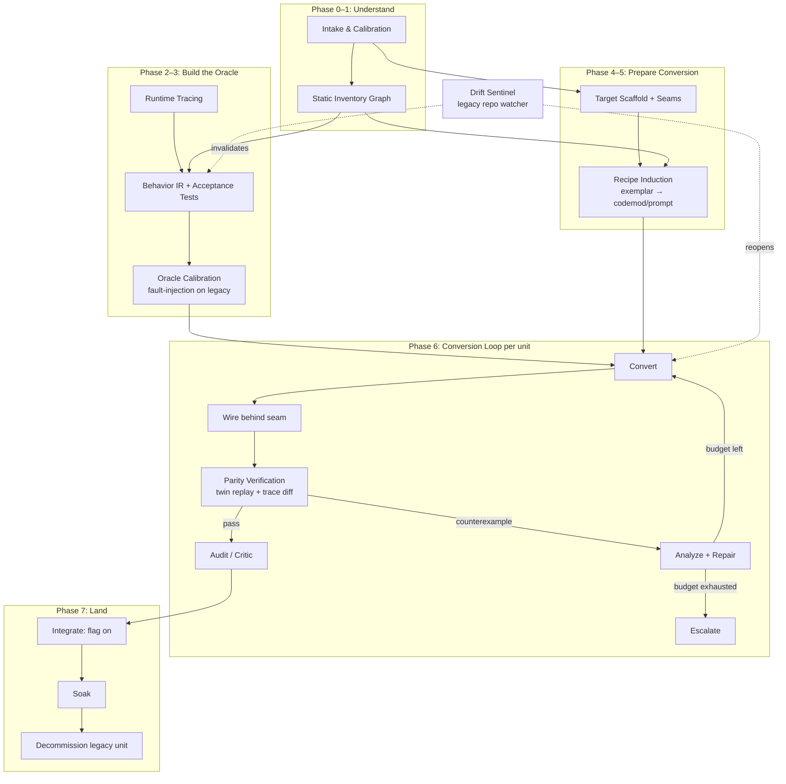

# AngularJS → React Migration Harness — System Architecture

> **Audience.** Two readers: (1) the human/orchestrator developer wiring this system up, and
> (2) the agents that execute inside it. Every document in `plans/` is written to be loaded
> directly into an agent's context. Documents are self-contained where possible; where they
> reference another document, the orchestrator is expected to include that document (or the
> named section) in the agent's context pack.

> **Scope.** This harness migrates **AngularJS 1.x (1.5–1.8)** single-page applications to
> **React**. It is generic and self-calibrating: it assumes nothing about the specific app
> except that (a) its source is available, and (b) it can be served and driven in a real
> browser. It is NOT for Angular 2+.

---

## 1. The one-paragraph theory of the system

Static translation of AngularJS is unreliable because AngularJS semantics are runtime-driven
(dependency injection resolved at runtime, `$scope` dataflow via watchers, DOM behavior hidden
in directive `compile`/`link` phases, jQuery plugins, `$rootScope` event buses, HTML compiled
from strings). Therefore this harness treats **execution as the oracle**: before any unit of
code is converted, the harness records what the legacy app *does* (semantic traces + acceptance
tests validated against the legacy app itself), and a unit is only accepted when the React
candidate produces equivalent behavior under the same harness. Conversion is performed by
agents following **recipes** (induced per-codebase from exemplar migrations), and every state
transition of every migration unit is **evidence-gated**: the orchestrator verifies artifacts
mechanically and never trusts an agent's claim of success.

## 2. Design principles (normative — agents and orchestrator MUST follow these)

| # | Principle | Concrete meaning |
|---|---|---|
| P1 | **Oracle before conversion** | No unit enters conversion until its acceptance scenarios run green against the *legacy* app. A test that never passed on legacy proves nothing about parity. |
| P2 | **Evidence-gated transitions** | Unit state advances only when the orchestrator has mechanically validated the required evidence (exit codes, schema-valid artifacts, trace diffs). An agent asserting "done" is not evidence. |
| P3 | **Budgeted loops** | Every retry loop (conversion attempts, repair attempts, tokens per unit) has a hard cap in the unit record. Exhausting a cap triggers escalation, never silent retry. This is the primary defense against cyclical repair loops. |
| P4 | **Curated context** | Agents never receive "the whole repo." The orchestrator assembles a deterministic Context Pack per task (see `01-STATE-AND-ARTIFACTS.md §6`). Weak agents fail from context overload before they fail from missing skill. |
| P5 | **Migrate by semantic class, not syntax** | Conversion follows the construct-mapping table (`phases/P5-recipe-induction.md §2`), never line-by-line translation of `$scope` mechanics into React. |
| P6 | **Legacy source is read-only** | No agent modifies AngularJS application source, ever. The only exception is the tracer shim, which lives in its own directory and is injected at serve time, not committed into legacy code paths. |
| P7 | **Coexistence over big-bang** | The app migrates unit-by-unit behind seams (route shell or custom-element bridge). Both implementations stay runnable until evidence retires the legacy one. |
| P8 | **Knowledge compounds** | Every successful repair and every counterexample updates the recipe library and lessons file. The harness must be measurably better at unit N+100 than at unit N. |
| P9 | **Divergence is explicit** | Intentional behavior changes (a11y fixes, bug fixes) require a Waiver artifact. The oracle never "loosens" silently. |
| P10 | **Resumability** | All state lives in files under `migration/`. Any agent can crash at any moment and a replacement can resume from the unit record + ledger alone. |

## 3. System diagram



## 4. Phase overview

Phases 0–5 are mostly sequential program-level phases. Phase 6 is a per-unit loop that runs
concurrently across many units. Phase 7 is per-unit and program-level teardown. Phases may
overlap: e.g., recipe induction (P5) continues throughout P6 as new motifs surface.

| Phase | Name | Entry criteria | Exit criteria | Doc |
|---|---|---|---|---|
| P0 | Intake & Calibration | Legacy source + a way to serve it | `charter.json` written and human-approved | `phases/P0-intake-calibration.md` |
| P1 | Static Inventory | Charter approved | `inventory/graph.json` complete; every source file accounted for; units sliced; risk-scored | `phases/P1-static-inventory.md` |
| P2 | Runtime Tracing | App serveable; inventory exists | Tracer shim working; scenario corpus recorded; traces stored & normalized | `phases/P2-runtime-tracing.md` |
| P3 | Behavior IR & Oracle | Traces exist for target flows | Every unit slated for conversion has ≥1 scenario; all scenarios green on legacy; high-risk units mutation-calibrated | `phases/P3-behavior-ir-and-oracle.md` |
| P4 | Target Scaffold & Seams | Charter approved | React app boots; seam mechanism proven with one hello-world unit embedded in legacy app; CI green | `phases/P4-target-scaffold-and-seams.md` |
| P5 | Recipe Induction | Inventory motifs clustered; scaffold exists | Every motif cluster covering >2% of units has a recipe with a verified exemplar | `phases/P5-recipe-induction.md` |
| P6 | Conversion Loop | Unit is `SPECIFIED` + deps satisfied | Unit `ACCEPTED` (or `ESCALATED`/`DEFERRED`/`QUARANTINED`) | `phases/P6-conversion-loop.md` |
| P7 | Integration & Decommission | Units passing | Legacy unit tombstoned; finally: AngularJS runtime removed | `phases/P7-integration-and-decommission.md` |

## 5. The migration workspace

The orchestrator owns a workspace with this layout. All coordination state is plain files —
JSON, NDJSON, and Markdown — so that any agent (or human) can inspect and resume.

```
workspace/
  legacy/            # checkout of the AngularJS app (READ-ONLY for all agents; P6 exception: none)
  target/            # the new React app (created in P4)
  shim/              # tracer instrumentation (P2) — injected at serve time, never merged into legacy/
  migration/         # ALL harness state (schemas in plans/schemas/)
    charter.json
    ledger.ndjson            # append-only event log; the source of truth for history
    inventory/
      graph.json             # nodes + edges of the legacy app
      motifs.json            # motif cluster assignments
      units.index.json       # unit id → file, quick lookup
    units/<unit-id>.json     # one record per migration unit (state machine position)
    behavior-ir/<scenario-id>.json
    traces/{legacy,target}/<scenario-id>/<run-id>.ndjson
    counterexamples/<ce-id>.json
    recipes/<recipe-id>.md   # YAML frontmatter (machine header) + markdown body
    recipes/stats.json
    lessons.md               # append-only distilled lessons (fed into converter context packs)
    waivers/<waiver-id>.json
    context-packs/           # cache of generated packs (optional)
    reports/dashboard.json   # rollup for humans
```

## 6. Actors

Full role cards with prompt templates: `03-AGENT-ROLES.md` and `prompts/`.

| Role | Phase | One-line mission |
|---|---|---|
| intake-analyst | P0 | Profile the codebase, probe runnability, draft the charter |
| inventory-cartographer | P1 | Build the static graph, slice units, score risk |
| tracer | P2 | Stand up instrumentation, record scenario traces |
| scenario-author | P3 | Write Behavior IR + Playwright tests; get them green on legacy |
| oracle-calibrator | P3 | Fault-inject legacy to prove the test suite would catch divergence |
| scaffolder | P4 | Build the React target app and prove the seam |
| recipe-miner | P5 | Cluster motifs, migrate exemplars, distill recipes |
| converter | P6 | Convert one unit following its recipe |
| verifier | P6 | Run parity suite, emit structured counterexamples (mostly mechanical) |
| counterexample-analyst | P6 | Turn a raw divergence into a minimal, actionable repair directive |
| critic | P6 | Review accepted code for slop, convention violations, recipe drift |
| integrator | P7 | Flip flags, manage soak, watch error budgets |
| decommissioner | P7 | Tombstone legacy units when evidence shows zero usage |
| drift-sentinel | cross | Watch legacy repo changes; invalidate affected scenarios/units |
| librarian | cross | Maintain recipes/stats/lessons; propose recipe revisions |

The **orchestrator** itself is not an agent: it is deterministic code the harness owner writes,
responsible for scheduling, gate validation, context-pack assembly, lease management, and
budget enforcement. Its required tool surface is specified in `02-TOOL-CONTRACTS.md`.

## 7. Reading order

For the orchestrator developer: 00 → 01 → 02 → 03 → phases in order → EXTENSIONS-OOB.md →
RISKS-AND-FAILURE-MODES.md.

For an executing agent: the orchestrator gives you a context pack. It will contain (a) your
role card, (b) the phase doc section for your current task, (c) the unit record and relevant
artifacts. You do not need, and should not request, documents outside your pack.

## 8. Glossary

| Term | Definition |
|---|---|
| **Unit** | The atomic thing that migrates and is tracked by a state machine: a route slice, component, directive, service, or filter. Slicing rules: `phases/P1-static-inventory.md §5`. |
| **Behavior IR** | A framework-neutral JSON spec of one user-observable scenario: route, preconditions, steps, expected evidence (ARIA, DOM, network, domain events). Schema: `schemas/behavior-ir.schema.json`. |
| **Semantic trace** | Normalized NDJSON event stream recorded while a scenario runs (user steps, network, ARIA milestones, console, AngularJS internals on the legacy side). Schema: `schemas/trace-event.schema.json`. |
| **Twin** | The pair (legacy implementation, React candidate) of one unit, runnable under the same scenario harness with the same network fixtures. |
| **Parity** | Equivalence of semantic traces under the active diff policy — not pixel or DOM identity. |
| **Counterexample** | A structured minimal description of one behavioral divergence between twins. Schema: `schemas/counterexample.schema.json`. |
| **Recipe** | A reusable conversion procedure for one motif: preconditions, steps, target pattern, pitfalls, verified exemplar. Schema header: `schemas/recipe.schema.json`. |
| **Motif** | A recurring AngularJS pattern cluster (e.g., "ngRepeat table with filter pipes", "directive wrapping a jQuery plugin"). |
| **Seam** | The coexistence boundary where React and AngularJS meet: route-shell (single-spa style) or element bridge (custom elements). |
| **Charter** | Phase 0 output: app profile, strategy decisions, budgets, routing table of model tiers. Schema: `schemas/charter.schema.json`. |
| **Waiver** | Signed-off record of an intentional divergence from legacy behavior. |
| **Tombstone** | Ledger event + marker recording that a legacy artifact is retired and why the evidence permitted it. |
| **Context Pack** | The deterministic bundle of documents/artifacts the orchestrator assembles for one agent task. Schema: `schemas/context-pack.schema.json`. |
| **Settle point** | The moment a scenario step is considered complete for assertion purposes: network idle + no pending timers + digest quiescent (legacy) / no pending React updates (target). |
| **Ratchet** | A CI mechanism that only permits monotone progress (e.g., count of AngularJS files may only decrease; parity suite may only grow). |
