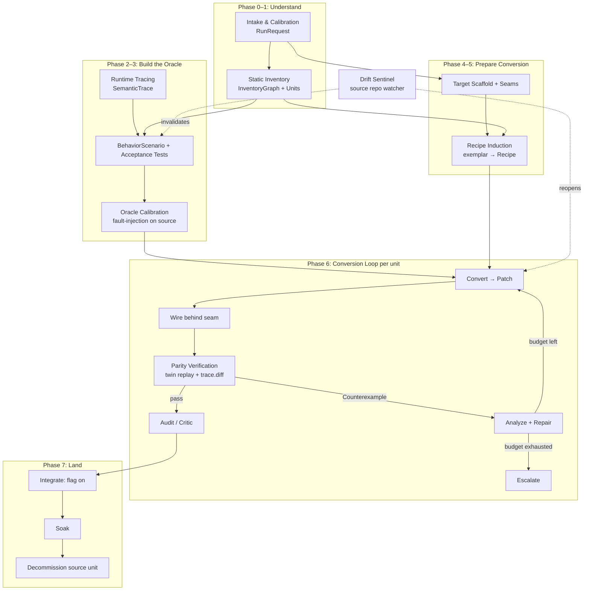

# System Architecture (v2, framework-neutral)

> **Status: normative.** v2 successor to `plans/00-ARCHITECTURE.md`, rewritten against
> `schemas-v2/`. Written for two readers: (1) the human/orchestrator developer wiring this system
> up, and (2) the agents that execute inside it. Every v2 document is loadable directly into an
> agent's context; where one references another, the orchestrator includes the named section in
> the agent's context pack (`RunManifest`).

> **Scope.** This harness migrates a **single-page application from one component framework to
> another**. The source and target frameworks are **parameters** (`RunRequest.source.framework`
> / `RunRequest.target.framework`), not assumptions. It assumes nothing about the specific app
> except that (a) its source is available, and (b) it can be served and driven in a real browser.
> The worked example throughout the v2 docs is **Angular 2+ → React** (the `angular2plus`
> adapter), but no orchestrator logic depends on that pairing; any framework whose behavior is
> observable in a browser fits.

---

## 1. The one-paragraph theory of the system

Static translation between component frameworks is unreliable because framework semantics are
runtime-driven (dependency injection resolved at runtime, reactive dataflow via change detection
/ signals / watchers, DOM behavior hidden in lifecycle hooks, third-party plugins, event buses,
templates compiled at runtime). Therefore this harness treats **execution as the oracle**: before
any unit of code is converted, the harness records what the source app *does* (`SemanticTrace`s +
acceptance `BehaviorScenario`s validated against the source app itself), and a unit is only
accepted when the target candidate produces equivalent behavior under the same harness. Conversion
is performed by agents following **recipes** (induced per-codebase from exemplar migrations), and
every state transition of every migration `Unit` is **evidence-gated**: the orchestrator validates
an `EvidenceBundle` mechanically and never trusts an agent's claim of success.

## 2. Design principles (normative — agents and orchestrator MUST follow these)

| # | Principle | Concrete meaning |
|---|---|---|
| P1 | **Oracle before conversion** | No unit enters conversion until its acceptance scenarios run green against the *source* app (gate G1). A test that never passed on source proves nothing about parity. |
| P2 | **Evidence-gated transitions** | Unit state advances only when the orchestrator has mechanically validated the required evidence — exit codes, schema-valid artifacts, trace diffs — assembled as an `EvidenceBundle`. An agent asserting "done" is not evidence. |
| P3 | **Budgeted loops** | Every retry loop (convert attempts, repair attempts, tokens per unit) has a hard cap in `Unit.budget`. Exhausting a cap triggers escalation (T17), never silent retry. Primary defense against cyclical repair loops. |
| P4 | **Curated context** | Agents never receive "the whole repo." The orchestrator assembles a deterministic context pack per task, audited by a `RunManifest` (`ORCHESTRATOR.md §8`). Weak agents fail from context overload before they fail from missing skill. |
| P5 | **Migrate by semantic class, not syntax** | Conversion follows the construct-mapping recipes, never line-by-line translation of reactive mechanics. The neutral `Unit.kind` + `sourceAdapter` classify the construct. |
| P6 | **Source is read-only** | No agent modifies source application code, ever. The only exception is the tracer shim, which lives in `shim/` and is injected at serve time, never committed into source paths. |
| P7 | **Coexistence over big-bang** | The app migrates unit-by-unit behind seams (route-shell or element-bridge), flag-controlled. Both implementations stay runnable until evidence retires the source one (`MigrationPlan.bridgePlan`). |
| P8 | **Knowledge compounds** | Every successful repair and every counterexample updates the recipe library and lessons file. The harness must be measurably better at unit N+100 than at unit N. |
| P9 | **Divergence is explicit** | Intentional behavior changes (a11y fixes, bug fixes) require an approved `DecisionRecord` (waiver). The oracle never loosens silently. |
| P10 | **Resumability** | All state lives in files under `migration/`. Any agent can crash at any moment and a replacement resumes from the `Unit` record + ledger alone. |

## 3. System diagram



## 4. Phase overview

Phases 0–5 are mostly sequential program-level phases. Phase 6 is a per-unit loop running
concurrently across many units. Phase 7 is per-unit and program-level teardown. Phases may
overlap (recipe induction continues through P6 as new motifs surface).

| Phase | Name | Entry criteria | Exit criteria | Doc |
|---|---|---|---|---|
| P0 | Intake & Calibration | Source available + a way to serve it | `RunRequest` written and human-approved | `phases/P0` |
| P1 | Static Inventory | RunRequest approved | `InventoryGraph` complete; every source file accounted for; `Unit`s sliced; risk-scored | `phases/P1` |
| P2 | Runtime Tracing | App serveable; inventory exists | Tracer shim working; scenario corpus recorded; `SemanticTrace`s stored & normalized | `phases/P2` |
| P3 | Behavior & Oracle | Traces exist for target flows | Every unit slated for conversion has ≥1 `BehaviorScenario`; all green on source; high-risk units mutation-calibrated | `phases/P3` |
| P4 | Target Scaffold & Seams | RunRequest approved | Target app boots; seam proven with one hello-world unit embedded in the source app; CI green | `phases/P4` |
| P5 | Recipe Induction | Motifs clustered; scaffold exists | Every motif cluster covering >2% of units has a `Recipe` with a verified exemplar | `phases/P5` |
| P6 | Conversion Loop | Unit `SPECIFIED` + deps satisfied | Unit `ACCEPTED` (or `ESCALATED`/`DEFERRED`/`QUARANTINED`) | `phases/P6` |
| P7 | Integration & Decommission | Units passing | Source unit tombstoned; finally: source framework runtime removed | `phases/P7` |

## 5. The migration workspace

The orchestrator owns a workspace of plain files — JSON, NDJSON, Markdown — so any agent or human
can inspect and resume. Schemas live in `schemas-v2/`.

```
workspace/
  legacy/            # checkout of the SOURCE app (READ-ONLY for all agents, always)
  target/            # the new TARGET app (created in P4)
  shim/              # tracer instrumentation (P2) — injected at serve time, never merged into legacy/
  migration/         # ALL harness state
    run-request.json         # RunRequest (was charter.json)
    plan.json                # MigrationPlan — computed waves + seam/bridge plan
    ledger.ndjson            # append-only LedgerEvent log; source of truth for history
    inventory/
      graph.json             # InventoryGraph: nodes + edges (neutral kinds; construct in sourceAdapter)
      motifs.json            # motif cluster assignments
      units.index.json       # unit id → file, quick lookup
    units/<unit-id>.json     # one Unit record per migration unit (state machine position)
    behavior-ir/<scenario-id>.json     # BehaviorScenario
    traces/{source,target}/<scenario-id>/<run-id>.ndjson   # SemanticTrace
    patches/<patch-id>.json  # Patch — first-class code change
    evidence/<bundle-id>.json # EvidenceBundle — hash-verified gate submissions
    counterexamples/<ce-id>.json       # Counterexample
    recipes/<recipe-id>.md   # Recipe: YAML frontmatter + markdown body
    recipes/stats.json
    lessons.md               # append-only distilled lessons (fed into context packs)
    decisions/<decision-id>.json       # DecisionRecord (waiver/deferral/quarantine/…)
    context-packs/<pack-id>.json       # RunManifest cache (optional)
    reports/run-result.json  # RunResult rollup for humans
```

## 6. Actors

Full role cards: `plans/03-AGENT-ROLES.md`; neutral role→artifact ownership: `ORCHESTRATOR.md §9`;
prompt templates: `prompts/`.

| Role | Phase | One-line mission |
|---|---|---|
| intake-analyst | P0 | Profile the codebase, probe runnability, draft the `RunRequest` |
| inventory-cartographer | P1 | Build the static graph, slice units, score risk |
| tracer | P2 | Stand up instrumentation, record scenario traces |
| scenario-author | P3 | Write `BehaviorScenario`s + tests; get them green on source |
| oracle-calibrator | P3 | Fault-inject source to prove the suite would catch divergence |
| scaffolder | P4 | Build the target app and prove the seam |
| recipe-miner | P5 | Cluster motifs, migrate exemplars, distill recipes |
| converter | P6 | Convert one unit following its recipe → `Patch` |
| verifier | P6 | Run parity suite, emit structured `Counterexample`s (mostly mechanical) |
| counterexample-analyst | P6 | Turn a raw divergence into a minimal, actionable repair directive |
| critic | P6 | Review accepted code for slop, convention violations, recipe drift |
| integrator | P7 | Flip flags, manage soak, watch error budgets |
| decommissioner | P7 | Tombstone source units when evidence shows zero usage |
| drift-sentinel | cross | Watch source repo changes; invalidate affected scenarios/units (T21) |
| librarian | cross | Maintain recipes/stats/lessons; propose recipe revisions |

The **orchestrator** is not an agent: it is deterministic code the harness owner writes,
responsible for scheduling, gate validation, context-pack assembly, lease management, and budget
enforcement. Its tool surface is `TOOL-CONTRACTS.md`; its state model is `ORCHESTRATOR.md`.

## 7. Reading order

Orchestrator developer: `ARCHITECTURE.md` → `ORCHESTRATOR.md` → `TOOL-CONTRACTS.md` →
`plans/03-AGENT-ROLES.md` → `phases/` in order → `README.md` (schema map) → adapter schemas.

Executing agent: the orchestrator gives you a `RunManifest` context pack. It contains (a) your
role card, (b) the phase-doc section for your task, (c) the `Unit` record and relevant artifacts.
You do not need, and should not request, documents outside your pack.

## 8. Glossary

| Term | Definition |
|---|---|
| **Unit** | The atomic tracked migration item: route slice, component, service, presentation, directive-like, pipe-like, module, store, primitive, or infra. Schema: `unit.schema.json`. |
| **BehaviorScenario** | Framework-neutral JSON spec of one user-observable scenario: route, preconditions, steps, expected evidence (ARIA, DOM, network, domain events). Schema: `behavior-scenario.schema.json`. |
| **SemanticTrace** | Normalized NDJSON event stream recorded while a scenario runs; framework-internal events collapse into a neutral `framework.event` kind + `frameworkEvent` adapter slot, side-tagged `source`/`target`. Schema: `semantic-trace.schema.json`. |
| **Twin** | The pair (source implementation, target candidate) of one unit, runnable under the same scenario harness with the same network fixtures. |
| **Parity** | Equivalence of semantic traces under the active diff policy + approved `DecisionRecord`s — not pixel or DOM identity. |
| **Counterexample** | Structured minimal description of one behavioral divergence between twins, with a stable `fingerprint`. Schema: `counterexample.schema.json`. |
| **Recipe** | Reusable conversion procedure for one motif: preconditions, steps, target pattern, pitfalls, verified exemplar; neutral `appliesTo.unitKinds` + source/target framework pairing. Schema: `recipe.schema.json`. |
| **Motif** | A recurring source-framework pattern cluster (e.g. "list+filter table", "directive-like wrapping a third-party plugin"). |
| **Seam** | The coexistence boundary where target and source meet: route-shell or element-bridge. Direction set by `RunRequest.strategy.shellDirection`. |
| **RunRequest** | Phase-0 output: source/target framework parameters, serving/instrumentation strategy, budgets, oracle policy. Schema: `run-request.schema.json`. |
| **MigrationPlan** | Computed ordered waves + per-unit seam assignment + bridge plan. Schema: `migration-plan.schema.json`. |
| **Patch** | First-class record of one code change for a unit (files, diffs, intent). Schema: `patch.schema.json`. |
| **EvidenceBundle** | Hash-verifiable set of artifacts submitted for one gate + the re-run check results. Schema: `evidence-bundle.schema.json`. |
| **DecisionRecord** | Signed-off human/agent decision: waiver, deferral, quarantine, escalation-resolution, scope-change. Schema: `decision-record.schema.json`. |
| **RunManifest** | Deterministic bundle of documents/artifacts assembled for one agent task (audit record). Schema: `run-manifest.schema.json`. |
| **RunResult / LedgerEvent** | Program rollup + the append-only ledger event shape. Schema: `run-result.schema.json`. |
| **Tombstone** | Ledger event recording that a source artifact is retired and why the evidence permitted it. |
| **Settle point** | The moment a scenario step is complete for assertion: network idle + no pending timers + framework quiescent (source) / no pending target updates. |
| **Ratchet** | A CI mechanism permitting only monotone progress (source file count only decreases; parity suite only grows). Values in `RunResult.ratchets`. |
| **Adapter** | A typed payload (`adapter-ref.schema.json`) filling a `sourceAdapter`/`targetAdapter` slot with framework-specific data (e.g. `adapters/angular2plus.schema.json`). |
